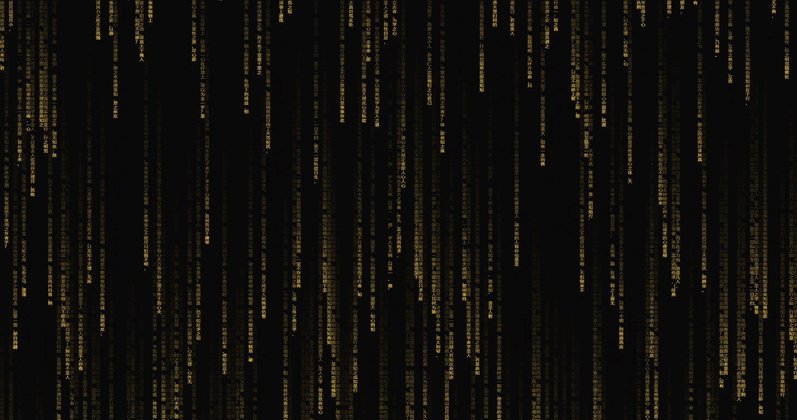

# Lively Wallpaper 插件

默认是日文随机字体，改成王阳明心学的金字了。可当成插件直接导入

效果图  

# Lively Wallpaper Plugin

The default is a random Japanese font, now changed to the golden characters from Wang Yangming's philosophy of mind. It can be imported directly as a plugin.

The screenshot of the effect:

The effect screenshot.
